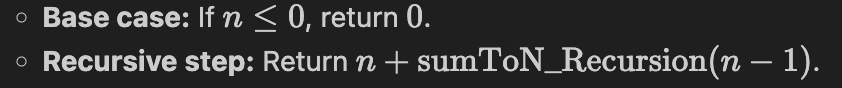

# Sum to N: Implementation Comparison

Three approaches to calculate the sum of integers from 1 to $n$, comparing their logic, efficiency, and resource usage.

---

## 1. Loop Implementation
An iterative approach using a standard loop to accumulate the sum.

* **Logic:**
    1. Initialize `total = 0`.
    2. Iterate from $i = 1$ to $i = n$.
    3. On each iteration, add $i$ to `total`.
    4. After the loop ends, return `total`.
* **Example (n = 5):** `total` updates as $1 \to 3 \to 6 \to 10 \to 15$.
* **Complexity:**
    * **Time:** $O(n)$ — The loop executes $n$ times.
    * **Space:** $O(1)$ — Uses only one accumulator variable.

---

## 2. Recursion Implementation
A functional approach where the function calls itself until it reaches a base case.

* **Logic:**

    <!-- * **Base case:** If $n \leq 0$, return $0$.
    * **Recursive step:** Return $n + \text{sumToN\_Recursion}(n - 1)$. -->
* **Example (n = 5):**
    * `sumToN(5)` $\to 5 + \text{sumToN}(4)$
    * `sumToN(4)` $\to 4 + \text{sumToN}(3)$
    * `sumToN(3)` $\to 3 + \text{sumToN}(2)$
    * `sumToN(2)` $\to 2 + \text{sumToN}(1)$
    * `sumToN(1)` $\to 1 + \text{sumToN}(0)$
    * `sumToN(0)` $\to 0$
* **Complexity:**
    * **Time:** $O(n)$ — Makes $n$ recursive calls.
    * **Space:** $O(n)$ — Each recursive call adds a frame to the call stack.

---

## 3. Formula Implementation
Uses the mathematical formula for the sum of an arithmetic progression.

* **Logic:** Uses the well-known mathematical identity:
    $$\text{Sum} = \frac{n(n + 1)}{2}$$
* **Complexity:**
    * **Time:** $O(1)$ — Constant operations regardless of the size of $n$.
    * **Space:** $O(1)$ — Only requires temporary variables for arithmetic.

---